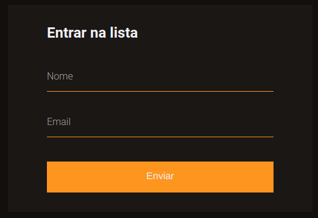

<h1 align="center"> Form Validation </h1>

Pequeno projeto que cria um sistema de validação de formulário através de uma API de validação do próprio HTML.

  <a href="#-tecnologias">Tecnologias</a>&nbsp;&nbsp;&nbsp;|&nbsp;&nbsp;&nbsp;
  <a href="#-projeto">Projeto</a>&nbsp;&nbsp;&nbsp;|&nbsp;&nbsp;&nbsp;
  <!--<a href="#-layout">Layout</a>&nbsp;&nbsp;&nbsp;|&nbsp;&nbsp;&nbsp;-->
  <a href="#memo-licença">Licença</a>

  

 

  

## 🚀 Tecnologias

Esse projeto foi desenvolvido com as seguintes tecnologias:

- HTML e CSS
- JavaScript
- Git e Github

## 💻 Projeto

O Form Validation é um protótipo que cria um sistema de validação de formulário a partir de uma API do HTML de validation.

Você pode ter acesso ao projeto online [clicando aqui](https://toddynan.github.io/form-validation/).

## :memo: Licença

Esse projeto está sob a licença MIT.

---

Powered by Rocketseat :wave: